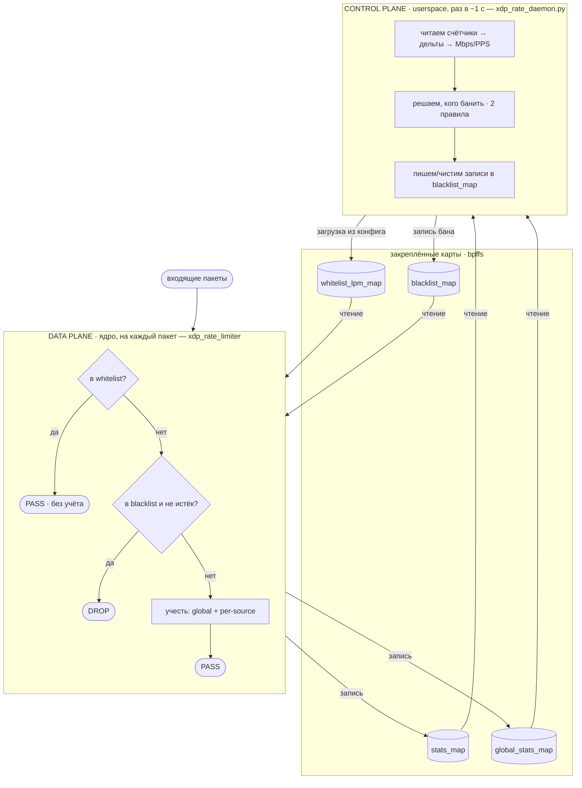

# Архитектура и механизм работы

[English](architecture.md) · [Русский](architecture.ru.md)

Подробный разбор того, как `xdp-rate-limit-smart` устроен внутри: путь пакета в
ядре, BPF-карты, которые связывают части воедино, жизненный цикл загрузчика и цикл
принятия решений в демоне. Установку и использование см. в
[README](../README.ru.md); краткую памятку для контрибьютора — в
[CLAUDE.md](../CLAUDE.md).

## Содержание

- [Схема в одной картинке](#схема-в-одной-картинке)
- [Зачем разделение](#зачем-разделение)
- [BPF-карты](#bpf-карты)
- [Data plane: XDP-программа](#data-plane-xdp-программа)
- [Загрузчик](#загрузчик)
- [Control plane: демон](#control-plane-демон)
- [Два правила бана](#два-правила-бана)
- [Жизненный цикл бана](#жизненный-цикл-бана)
- [Правильное чтение счётчиков](#правильное-чтение-счётчиков)
- [Контракты между компонентами](#контракты-между-компонентами)
- [Связка через systemd](#связка-через-systemd)

## Схема в одной картинке



Загрузка/attach/pin — `src/xdp_loader.c` (`load | unload`); связка воедино —
systemd + `src/xdp-rate-limit-wrapper`.

Программа в ядре — это **data plane** (плоскость данных): она выполняется на
каждом пакете и потому должна быть крошечной и быстрой, поэтому только *считает* и
*отбрасывает*. Python-программа — это **control plane** (плоскость управления): она
запускается раз в интервал, делает всю арифметику и политику и передаёт решения
обратно в ядро исключительно через правку карты.

## Зачем разделение

Если бы политика жила внутри XDP-программы, пришлось бы пересчитывать скорости и
пороги в горячем пути на каждом пакете — дорого и негибко. Вместо этого:

- XDP-программа хранит **сырые накопительные счётчики** (байты/пакеты), а это почти
  бесплатно: пара lookup'ов по картам и сложений на пакет.
- Демон снимает эти счётчики по таймеру, вычисляет **скорости из дельт** и
  применяет настраиваемую человеком политику (пороги, длительность бана, whitelist).

Единственное общее состояние — четыре закреплённые (pinned) карты. Ни одна сторона
не вызывает другую; они общаются только через содержимое карт. Именно поэтому
**раскладка** карт (размеры и порядок байт) — жёсткий контракт, см.
[Контракты между компонентами](#контракты-между-компонентами).

## BPF-карты

Все четыре объявлены в
[`src/xdp_rate_limit.bpf.c`](../src/xdp_rate_limit.bpf.c) и закрепляются
загрузчиком в `/sys/fs/bpf/xdp-rate-limit/<iface>/`.

| Карта | Тип | Ключ | Значение | Пишет | Читает |
| --- | --- | --- | --- | --- | --- |
| `stats_map` | `LRU_PERCPU_HASH` (262144) | `u32` src IPv4, **сетевой порядок** | `traffic_stats {u64 bytes, u64 packets}` | XDP | демон |
| `global_stats_map` | `PERCPU_ARRAY` (1) | `u32` индекс `0` | `traffic_stats` | XDP | демон |
| `blacklist_map` | `HASH` (262144) | `u32` src IPv4, сетевой порядок | `ban_value {u64 expires_ns}` | демон | XDP |
| `whitelist_lpm_map` | `LPM_TRIE` (4096) | `ipv4_lpm_key {u32 prefixlen, u32 addr}` | `u8` | демон | XDP |

Два решения, о которых стоит сказать отдельно:

- **Per-CPU** (`stats_map`, `global_stats_map`): каждое ядро процессора инкрементит
  свою приватную копию счётчика, поэтому нет «пинг-понга» кэш-линий между ядрами и
  не нужны атомарные операции в пути пакета. Демон при чтении **суммирует по всем
  CPU**.
- **LRU** (`stats_map`): таблица по источникам ограничена 262144 записями; при
  заполнении ядро вытесняет наименее недавно использованную запись, освобождая
  место. Это удерживает потребление памяти при потоке из множества разных IP — но
  ровно поэтому же флуд с подменой/рандомизацией source IP обходит учёт (вытесненная
  запись начинается с нуля и никогда не накапливает дельту, достаточную для бана).

## Data plane: XDP-программа

`xdp_rate_limiter` выполняется в самой ранней точке сетевого стека (в драйвере
NIC, либо в generic-хуке как запасной вариант). Для каждого кадра она проходит
фиксированную последовательность решений:

```
1. Разбор Ethernet-заголовка (с проверкой границ).
   ├─ Проходим до 2 VLAN-тегов (802.1Q / 802.1AD).
   └─ Если итоговый EtherType не IPv4  → XDP_PASS   (IPv6, ARP … не трогаем)

2. Разбор IPv4-заголовка (с проверкой границ). src = iph->saddr  (сетевой порядок)

3. Lookup в whitelist (LPM: точный /32 для обычного IP или любой покрывающий CIDR):
   └─ попадание → XDP_PASS  сразу. Без учёта, без проверки бана.

4. Lookup в blacklist:
   └─ попадание И (expires_ns == 0  ИЛИ  expires_ns > now) → XDP_DROP
      (expires_ns == 0 — постоянный бан; иначе дедлайн в монотонных нс)

5. Учёт (достижим, только если пакет будет PASS):
   ├─ global_stats_map[0].bytes   += frame_len ;  .packets += 1
   └─ stats_map[src].bytes        += frame_len ;  .packets += 1
      (при первом появлении создаёт запись по источнику)

6. XDP_PASS
```

Две тонкости:

- **Порядок важен — учёт идёт после проверки blacklist.** Отброшенный пакет *не*
  учитывается. Поэтому уже забаненный атакующий трафик не раздувает глобальный итог
  и не попадает в список топ-источников. Это делает smart-режим
  **самокорректирующимся**: как только худшие нарушители забанены, их трафик
  перестаёт считаться, суммарный показатель интерфейса падает ниже глобального
  порога, «ворота» закрываются, и новые IP не банятся. См.
  [два правила бана](#два-правила-бана).
- **Whitelist проверяется раньше всего.** Whitelisted адреса админа/SSH не
  учитываются и не могут быть забанены; они не заблокируют вам доступ и не будут
  отброшены из-за устаревшей записи в blacklist.

`frame_len` — это `data_end - data`, размер кадра «на проводе» на входе. Поэтому
Mbps демона близок, но не идентичен цифрам биллинга у провайдера.

## Загрузчик

[`src/xdp_loader.c`](../src/xdp_loader.c) — небольшая libbpf-программа с двумя
подкомандами. Это единственный компонент, который трогает сам XDP-attach.

**`load IFACE OBJ PIN_DIR [auto|native|generic]`**

1. Поднять `RLIMIT_MEMLOCK` (BPF-карты — залоченная память).
2. `bpf_object__open_file` + `bpf_object__load` скомпилированного `.bpf.o`.
3. Найти программу по имени `xdp_rate_limiter`.
4. **Самолечение:** сначала отцепить оставшийся экземпляр *нашей собственной*
   программы, чтобы после нечистой предыдущей остановки attach не упал с `EBUSY`.
   Чужие XDP-программы не трогаются, если не задан `XDP_FORCE=1`.
5. Attach: в режиме `auto` сначала пробуем **native** (драйверный) XDP, при
   отсутствии поддержки в драйвере откатываемся на **generic** (SKB).
6. Стереть и пересоздать `PIN_DIR`, затем закрепить туда все карты и программу.
   Стирание сначала делает перезапуски идемпотентными — иначе устаревшие пины от
   прошлого запуска приведут к ошибке `EEXIST` при закреплении.
7. Записать режим attach в файл `mode` внутри pin-каталога.

**`unload IFACE PIN_DIR [--force]`**

- Читает id закреплённой программы и отцепляет её, только если id, привязанный
  сейчас к интерфейсу, совпадает — так удаляется *своя* программа и никогда чужая.
  С `--force` (или `XDP_FORCE=1`) отцепляет то, что привязано.
- Если пин пропал (креш, частичная очистка) — откатывается на отцепление **по
  имени**, чтобы осиротевшая копия нашей программы всё равно была удалена.
- В конце `rm -rf` pin-каталога.

Сквозной приём идентификации — **имя программы** `xdp_rate_limiter`
(`XDP_PROG_NAME`), которое ядро отдаёт в `bpf_prog_info.name`. Именно так загрузчик
отличает «свою» от «чужой» без пина.

## Control plane: демон

[`src/xdp_rate_daemon.py`](../src/xdp_rate_daemon.py) общается с закреплёнными
картами напрямую через системный вызов `bpf(2)` посредством `ctypes` — без BCC,
без libbpf. Класс `BpfMap` оборачивает закреплённую карту (получаемую через
`BPF_OBJ_GET` по её пути) и предоставляет `lookup` / `update` / `delete` / `keys` /
`items`.

Старт (`XdpRateDaemon.__init__`):

1. Открыть четыре закреплённые карты, объявив для каждой размеры ключа/значения и
   признак per-CPU (это должно точно совпадать с C-структурами).
2. `reload_config(force=True)` — загрузить `config.json` и залить whitelist в
   `whitelist_lpm_map`.
3. `load_existing_bans()` — прочитать `blacklist_map`, отбросить уже истёкшие
   записи, а остальные запомнить. Это восстанавливает баны после *нечистой*
   остановки, где запиненные карты уцелели (креш, `SIGKILL`); при чистой
   остановке/перезапуске пины сначала стираются (см.
   [связку через systemd](#связка-через-systemd)), так что восстанавливать обычно
   нечего — чтение просто возвращает пустую карту.

Затем `run()` крутит цикл: `tick()` каждые `interval_seconds`, перехватывая и
логируя любое исключение как `tick failed` (чтобы разовая ошибка не убила демон).

### Один тик по шагам

```
tick():
  reload_config()                     # горячая перезагрузка, если mtime config.json изменился
  если первый тик:                    # нужна базовая точка, прежде чем появится дельта
      сохранить пред. счётчики ; return
  elapsed_s = (now - prev_tick) по монотонным часам
  cleanup_expired_bans(now)           # удалить и залогировать UNBAN для истёкших банов
  global_mbps, global_pps = read_global_rate(elapsed_s)
  rates = read_rates(elapsed_s)       # дельты по IP → Mbps/PPS, сортировка по убыванию
  candidates = {}
  for r in rates:                     # ПРАВИЛО 1 — прямой per-IP (всегда включено)
      если r выше per_ip_*_limit: candidates[r] = "direct-per-ip"
  если smart_global_enabled и (global выше global_*_limit):   # ПРАВИЛО 2 — smart
      for r in rates:
          если r выше smart_ban_min_*: candidates.setdefault(r, "smart-global")
  for r из candidates по убыванию скорости, не более max_bans_per_tick:
      ban(r)
  раз в summary_log_interval_seconds: залогировать одну сводную строку
```

Порог метрики, равный `0`, означает **выключено**: помощник `over(value, limit)`
возвращает истину, только когда `limit > 0 и value >= limit`. Так что
`global_pps_limit: 0` значит «для глобальных ворот использовать только Mbps».
Можно задать и Mbps, и PPS одновременно; достаточно превышения любого из них.

## Два правила бана

Оба правила строят кандидатов из одного и того же списка скоростей по IP; источник
может быть помечен любым из них.

**Правило 1 — прямой per-IP лимит** (`per_ip_mbps_limit` / `per_ip_pps_limit`).
Безусловное: любой отдельный IP выше лимита банится немедленно, независимо от того,
насколько загружен интерфейс. По умолчанию выключено (лимиты `0`). В логе причина:
`direct-per-ip`.

**Правило 2 — умный глобальный режим** (`smart_global_enabled` + пары `global_*`
и `smart_ban_min_*`). Правило с двумя воротами: банит IP, только если в этом тике
**оба** условия истинны:

1. *Глобальные ворота* — весь интерфейс выше `global_mbps_limit` (или
   `global_pps_limit`). Если нет — в этом тике никаких smart-банов вообще.
2. *Ворота по источнику* — конкретный IP выше `smart_ban_min_mbps` (или
   `smart_ban_min_pps`).

В логе причина: `smart-global`. Смысл в том, чтобы не трогать даже довольно
нагруженных клиентов, пока канал спокоен, и начинать банить самых крупных
«вкладчиков», только когда совокупный трафик реально становится проблемой. В
сочетании с [порядком «учёт после blacklist»](#data-plane-xdp-программа) система
склонна забанить ровно столько IP, сколько нужно, чтобы вернуть итог под ворота, и
затем остановиться.

Кандидаты обоих правил объединяются (`direct-per-ip` выигрывает по причине, если IP
попал под оба, так как добавляется первым), сортируются по скорости и банятся от
самого крупного, но не более `max_bans_per_tick` — предохранитель, чтобы сбой
измерения не забанил тысячи IP за один тик.

## Жизненный цикл бана

- **Выдача** (`ban()`): пропустить, если в whitelist; вычислить `expires_ns = now +
  ban_seconds` (или `0` для постоянного бана, когда `ban_seconds == 0`); записать
  запись в `blacklist_map`. Начиная со следующего пакета, XDP-программа отбрасывает
  этот источник.
- **Продление**: если IP уже забанен и продолжает нарушать, при
  `extend_ban_on_repeat = true` бан сдвигается на новый, более поздний дедлайн;
  иначе существующий бан оставляют доистекать. Бан никогда не укорачивается.
- **Истечение**: баны несут абсолютный дедлайн в монотонных нс. XDP-программа
  перестаёт отбрасывать, как только `now >= expires_ns`; `cleanup_expired_bans` в
  демоне удаляет запись карты и логирует `UNBAN`. Обе стороны используют **одни и
  те же монотонные часы** (`bpf_ktime_get_ns()` в ядре, `time.monotonic_ns()` в
  Python), поэтому дедлайны совпадают.
- **Карта заполнена**: `blacklist_map` вмещает 262144 записи. При переполнении
  `update` падает с `E2BIG`; демон логирует ошибку и пропускает бан (существующие
  баны продолжают работать).
- **Dry-run** (`dry_run: true`): всё выполняется и логируется как `DRY-RUN BAN`, но
  запись не пишется — ничего реально не отбрасывается. Используйте для калибровки
  порогов на реальном трафике.

## Правильное чтение счётчиков

Три детали делают чтение из userspace согласованным с раскладкой ядра:

- **Суммирование по CPU.** Lookup по per-CPU карте возвращает по одному блоку
  значения *на каждый возможный CPU* (из `/sys/devices/system/cpu/possible`, а не
  только онлайн-ядра), каждый выровнен до 8 байт. `unpack_stats` проходит по блокам
  и суммирует их; для обычной карты цикл просто выполняется один раз.
- **Дельты, а не абсолюты.** Счётчики только растут. Каждый тик демон вычитает
  предыдущий отсчёт и делит на измеренный `elapsed_s`, получая скорость:
  `Mbps = dbytes*8 / 1e6 / elapsed_s`, `PPS = dpackets / elapsed_s`. Новые записи
  (без предыдущего отсчёта) пропускаются на один тик — поэтому совсем новый источник
  ловится только при втором появлении.
- **Пакетный обход (batch).** Наивное сканирование таблицы по источникам стоит два
  системных вызова на запись (`GET_NEXT_KEY` + `LOOKUP_ELEM`). При десятках тысяч
  активных источников это доминирует по CPU, поэтому `BpfMap.items` использует
  `BPF_MAP_LOOKUP_BATCH`, вытягивая до ~1024 пар ключ+значение за один вызов, и
  навсегда откатывается на путь по одному ключу на ядрах без поддержки batch (до
  5.6, `EINVAL`/`ENOTSUPP`).

## Контракты между компонентами

Поскольку C-программа, C-загрузчик и Python-демон — три отдельных бинарника,
делящих закреплённые карты *по сырой раскладке памяти*, некоторые вещи должны
меняться синхронно. Измените одну сторону без другой — и получите тихое повреждение
данных, а не ошибку компиляции.

- **Размеры ключа/значения карт** захардкожены в демоне (`BpfMap(path, key_size,
  value_size, percpu=...)`). Если меняете структуру в `.bpf.c`, обновите
  соответствующие размеры `BpfMap` и все форматные строки `struct.pack` / `unpack`.
- **Порядок байт.** Ключи IPv4 хранятся в *сетевом* порядке (`inet_aton`).
  `ipv4_lpm_key` — это *little-endian* `prefixlen`, за которым идёт адрес в сетевом
  порядке. Счётчики и `expires_ns` — little-endian `u64`.
- **Имя программы** `xdp_rate_limiter` — проверка идентичности в загрузчике.
  Переименование функции `SEC("xdp")` ломает самолечащее отцепление, если не
  обновить и `xdp_loader.c`.
- **Номера команд `bpf(2)`** в демоне — это сырые константы системного вызова
  (`BPF_OBJ_GET = 7`, `BPF_MAP_LOOKUP_BATCH = 24`, …). Они не взаимозаменяемы с
  командой info-by-fd; не «исправляйте» их.

## Связка через systemd

Шаблонный юнит
[`systemd/xdp-rate-limit@.service`](../systemd/xdp-rate-limit@.service) привязывает
один экземпляр сервиса к одному интерфейсу через спецификатор `%i`
(`xdp-rate-limit@ens3` → интерфейс `ens3`). Он запускает скрипт-связку
[`src/xdp-rate-limit-wrapper`](../src/xdp-rate-limit-wrapper):

- `ExecStart … %i start` — убедиться, что bpffs смонтирован, выполнить `load`
  загрузчика, затем `exec` демона (так демон становится главным процессом сервиса и
  получает `SIGTERM` при остановке).
- `ExecStopPost … %i stop` — выполнить `unload` загрузчика, чтобы отцепить XDP и
  удалить пины после выхода демона.

`Restart=on-failure` возвращает демон после креша; поскольку `load` идемпотентен и
самолечащ, перезапуск чисто переприсоединяется, а не громоздит дубликаты
XDP-программ. Неуклонно растущий `NRestarts` — сигнал разобраться с настоящим циклом
перезапусков.

Отдельно про то, что перезапуск делает с банами. При **чистой** остановке/рестарте
`ExecStopPost` выполняет `unload`, который удаляет pin-каталог, а с ним и
`blacklist_map`; затем `ExecStart` пересоздаёт карты пустыми, так что активные баны
сбрасываются. Это задумано и безвредно — баны временные, а любой источник, всё ещё
превышающий лимит, будет перебанен за один-два тика. `load_existing_bans()`
восстанавливает баны только после **нечистой** остановки, где `ExecStopPost` не
отработал и пины уцелели (креш, `SIGKILL`). В любом случае `/sys/fs/bpf` — это
tmpfs, поэтому баны не переживают перезагрузку.
